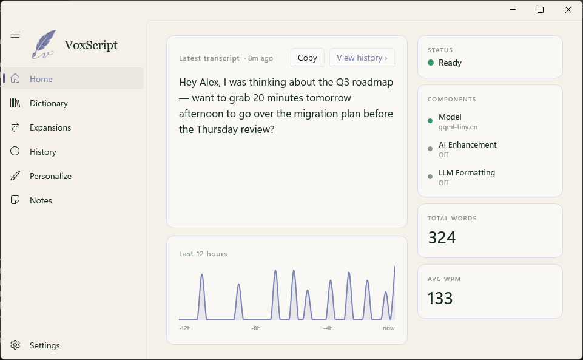

# VoxScript



> Local, private voice-to-text for Windows. Press and hold, speak, release — your words appear at the cursor.

[](LICENSE)
[](https://github.com/rohilrs/VoxScript/releases/latest)


**Status:** Early-adopter release (v0.x). Feature-complete for daily use, but unsigned and not yet battle-tested on every machine. x64 Windows only (ARM64 planned for a later release).

## Features

- **Dictate anywhere** — global hotkey (Ctrl+Win) pastes into any app
- **Local by default** — whisper.cpp runs on your machine, not in the cloud
- **Vulkan GPU acceleration** — ships bundled; runs on any modern GPU
- **Smart formatting** — spoken punctuation, number conversion, lists, emails, URLs
- **Optional AI enhancement** — OpenAI, Anthropic, or local Ollama; per-app context modes
- **Custom dictionary + corrections** — teach VoxScript your jargon
- **History, Notes, Expansions** — full-featured app, not just a dictation box

## Install

Requires Windows 10 20H1+ (build 19041+) or Windows 11.

1. Download `VoxScript-Setup-v{latest}.exe` from the [latest release](https://github.com/rohilrs/VoxScript/releases/latest).
2. Double-click to install. The installer is currently unsigned — Windows SmartScreen will show a **"Windows protected your PC"** warning. Click **More info**, then **Run anyway** to proceed.
3. VoxScript launches, walks you through a one-time setup (mic check + model download ~140 MB), then lives in your system tray.

**Prefer portable?** Grab `VoxScript-Portable-v{latest}.zip` from the same release, extract anywhere, run `VoxScript.exe`.

## Quick Start

| Hotkey | Action |
|---|---|
| `Ctrl + Win` (hold) | Hold-to-dictate — release to paste |
| `Ctrl + Win`, tap `Space` | Toggle-lock recording — tap again to stop |
| `Alt + Shift + Z` | Paste last transcript |

All hotkeys are configurable in Settings → Keybinds.

## Privacy

- **Transcription** runs locally via whisper.cpp. No audio leaves your machine.
- **AI Enhancement** is opt-in. When enabled, the transcribed text (not audio) is sent to your chosen provider (OpenAI, Anthropic, or local Ollama). API keys are stored in Windows Credential Manager — never in plain text.
- **No telemetry.** VoxScript makes no analytics or crash-reporting network calls.

## Building from source

Requirements: Windows 10 20H1+ (build 19041+), [.NET 10 SDK](https://dotnet.microsoft.com/download/dotnet/10.0).

```powershell
git clone https://github.com/rohilrs/VoxScript.git
cd VoxScript
dotnet build VoxScript.slnx
dotnet test VoxScript.Tests
dotnet run --project VoxScript
```

Pre-built whisper + ggml DLLs (including Vulkan-enabled) live in `VoxScript/NativeBinaries/x64/`. To rebuild them from source with Vulkan support, install the [Vulkan SDK](https://vulkan.lunarg.com/) and see `native/whisper/build.ps1`.

## License

MIT — see [LICENSE](LICENSE).

## Acknowledgments

- [whisper.cpp](https://github.com/ggerganov/whisper.cpp) — local transcription engine
- [VoiceInk](https://github.com/Beingpax/VoiceInk) — the macOS app VoxScript was ported from
- [NAudio](https://github.com/naudio/NAudio) — audio capture
- [WinUI 3](https://learn.microsoft.com/en-us/windows/apps/winui/winui3/) + Windows App SDK
- [Velopack](https://velopack.io) — installer and auto-update framework
